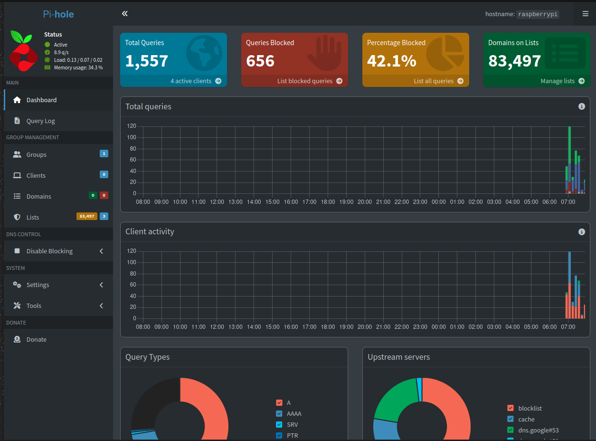

# pihole-adblocker

Built an ad and tracker blocker on a Raspberry Pi Zero 2 W. It runs Pi-hole to filter DNS request on the home network for every device.

## Overview
This projects converts the Raspberry Pi zero 2 W into a DNS sinkhole which blocks ads and trackers for all connected devices (laptops, phones) without requirinng to install adblocker perdevice.

## Hardware
- Raspberry Pi Zero 2 W
- MicroSD card (Raspberry Pi OS Lite (Legacy, 32-bit))

## Tech Stack
- Raspberry Pi OS Lite (Legacy, 32-bit)
- Pi-hole
- SSH for remote administration
- Static IP networking

## Setup Highlights
- Headless OS installlation
- SSH configuration
- Static IP assignment for reilable DNS resolution
- Custom blocklist added (StevelBlac host list + default lists)
- per-device DNS configuration to filter network wide

## Results
- 80.000+ domains on active blocklists
- Real time query monitoring via Pi-hole dashboard
- 42%+ of DNS queries blocked

## Dashboard Screenshot

## What I Learned
- Linux networking fundamentals (DNS, static IP, DHCP)
- Remote server administration via SSH
- Setting up and managing a self-hosted service

